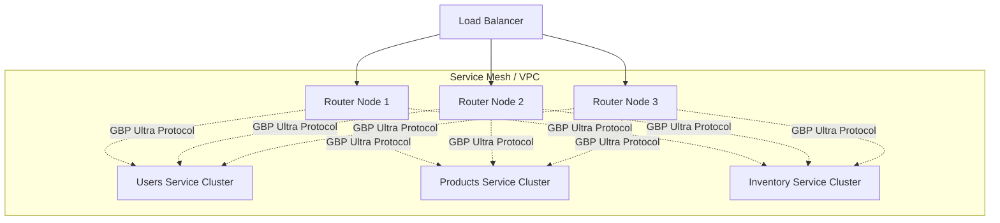

# Scalability Analysis & Capacity Planning

## Executive Summary

Based on local benchmarks of the **GBP Ultra Router** (v0.5.4), moving to a distributed architecture (Kubernetes/Bare Metal) unlocks massive scalability.

**Current Verified Performance (Local/Shared Resources):**
- **Throughput:** 33,691 RPS
- **Latency (P50):** 2.5ms
- **Conditions:** Router + 2 Subgraphs + Load Generator on single machine (High CPU contention)

## Distributed Architecture Projection

By separating components onto dedicated hardware, we eliminate resource contention and leverage the full power of the "Scatter-Gather" architecture.

### 1. The Multi-Node Setup

### 2. Performance Projections

| Component | Resource | Est. Capacity per Node (4vCPU) | Scaling Strategy |
|-----------|----------|--------------------------------|------------------|
| **Router** | CPU-Bound | **100,000 - 150,000 RPS** | Horizontal (Stateless) |
| **Subgraph** | Logic-Bound | 5,000 - 20,000 RPS | Horizontal + Vertical |
| **GBP Link** | Network | **~10Gbps = 5M+ RPS** | N/A (Negligible) |

*Note: GBP Ultra reduces payload density by 99%, making 10Gbps links effectively behave like 1Tbps links for JSON equivalent traffic.*

### 3. "The Million Request" Simulation

To handle **1 Million RPS**:

- **Routers**: ~10 Pods (allowing for redundancy and bursts)
- **Subgraphs**: Depends on complexity.
    - If a subgraph handles 10k RPS/core:
    - total capacity needed = 1M RPS
    - Subgraph Cores = 100 cores (e.g., 25 pods with 4 vCPU)
- **Network**:
    - With JSON: ~40 Gbps throughput (requires high-end networking)
    - **With GBP**: **~400 Mbps throughput** (Runs on standard gigabit NICs!)

## Why It Scales

1.  **Zero-Contention Routing**: The Router only decodes/encodes. It acts as a high-speed traffic cop.
2.  **Streaming Parallelism**: `FuturesUnordered` implementation allows the router to process subgraph responses *as they arrive*. It does not wait for the slowest subgraph to start processing others.
3.  **Independent Scaling**: 
    - Heavy compute subgraph? Scale it to 50 nodes.
    - Router CPU spiking? Scale routers to 20 nodes.
    - Providing independent levers for Cost vs. Performance.

## Recommended Stack

- **Orchestration**: Kubernetes (EKS/GKE)
- **Networking**: Cilium or connection-optimized CNI
- **Hardware**: Compute Optimized instances (e.g., AWS c7g.xlarge) for Routers; General Purpose (m7g) for Subgraphs.
